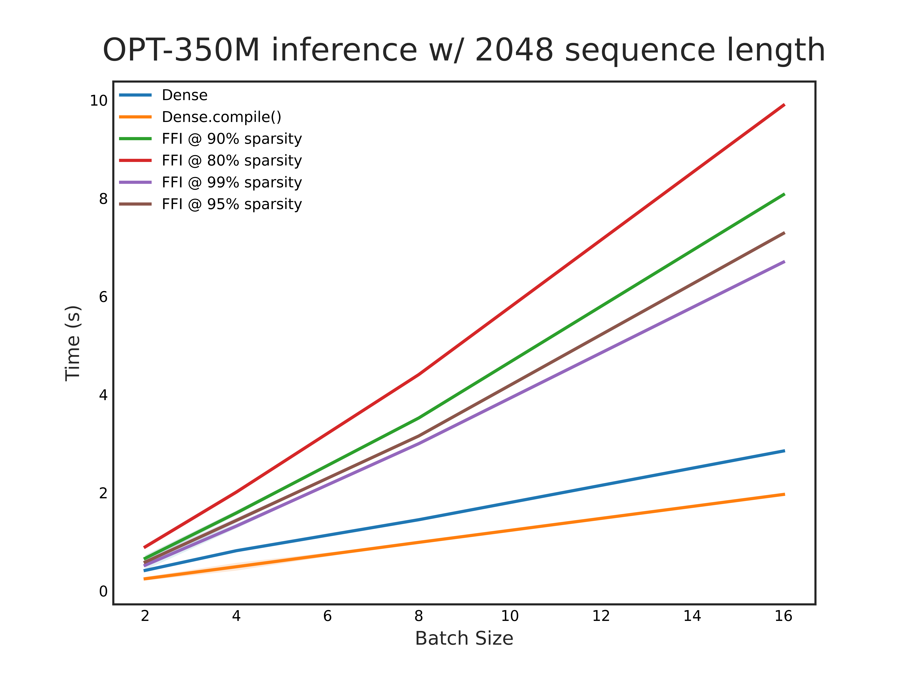

This repo is a work in progress. Fixed fan-in HIP kernels have been implemented but require further tuning as you can see below:



### Getting started 
- `./rocm_torch_extension` - includes HIP kernels for fixed fan-in kernels. 
- `./squash` - python frontend for bindings and running benchmarks.

### Building docker image

```bash
    docker build -t squash .
```

Check if amd GPU is renderD128 and renderD129 if you have 2 GPUs (or more), in my case it is renderD128

`docker run -itd --device /dev/kfd --device /dev/dri/renderD128 -v $(pwd):/workspace squash`

### Unit tests and benchmarking
Usage steps: 
1. Run `python3 ./squash/trainer.py` to run some quick unit tests. 
2. Run `python3 ./squash/benchmark.py 0.9` to benchmark 90% sparse fixed-fan in kernels on OPT-350M vs. dense benchmarks. 
3. To reproduce plot, run `python3 ./squash/benchmark.py 0.9 && python3 ./squash/benchmark.py 0.95 && python3 ./squash/benchmark.py 0.99` and then run all cells in `./notebooks/plots.ipynb`.